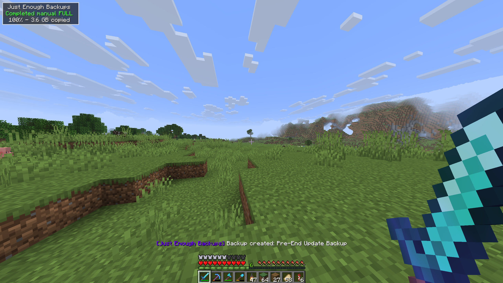
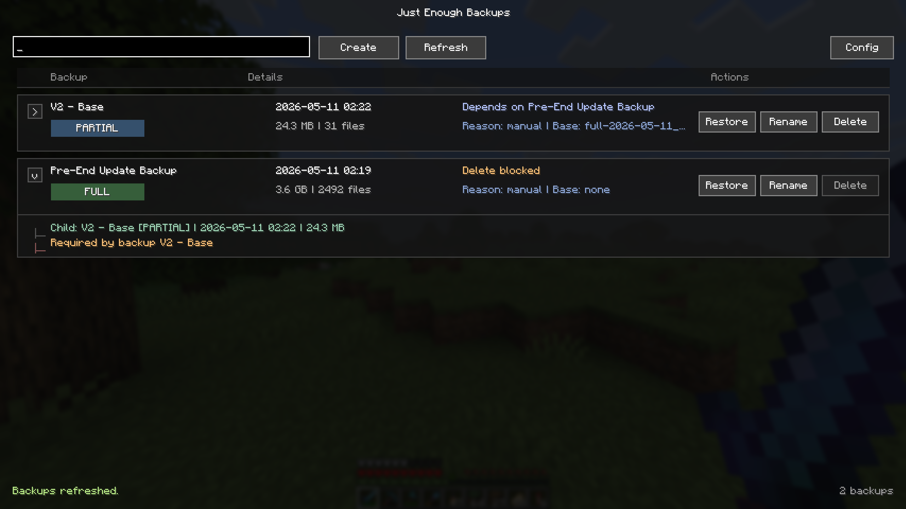
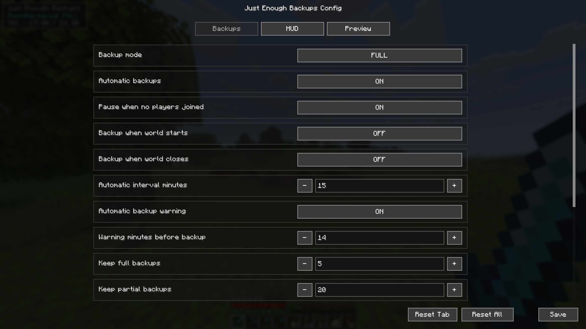
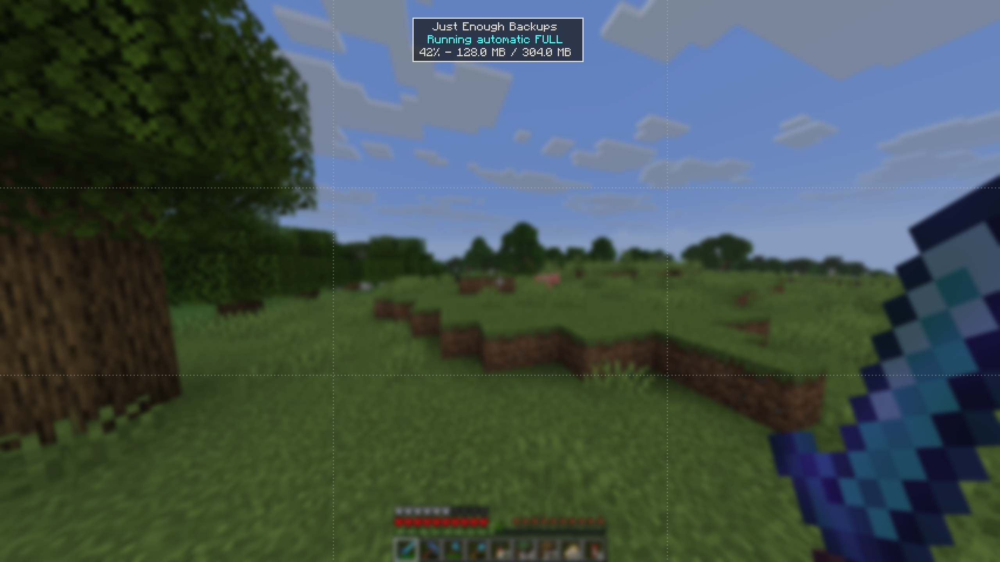

<p align="center">
  
</p>

<p align="center">
  <a href="https://www.curseforge.com/minecraft/mc-mods/just-enough-backups"></a>
  &nbsp;
  <a href="https://modrinth.com/mod/justenoughbackups-jeb"></a>
</p>

Just Enough Backups is a Fabric mod that adds server-side world backups with a usable in-game workflow.

It supports:

- full, partial, and differential backups
- manual backups through commands and UI
- automatic scheduled backups
- configurable public backup/restore announcements
- retention by backup count
- retention by total backup size per world
- restore preparation from the backup browser
- a configurable client HUD popup with live preview
- parallel (multi-threaded) scanning, compression, and restore extraction
- optional Mod Menu integration

The mod is designed to keep the actual backup logic on the server side while exposing management and configuration through a client UI.

## Screenshots









## Features

### Backup types

- **Full**: stores a complete snapshot of the world.
- **Partial**: stores changes relative to a base backup.
- **Differential**: stores changes relative to a base backup, while keeping a separate retention bucket from partial backups.

Dependencies between backups are tracked. Retention and delete operations respect those dependencies, so required base backups are preserved when newer partial or differential backups still depend on them.

### Automatic backups

Automatic backups are driven by per-type schedulers (`FULL`, `DIFFERENTIAL`, `PARTIAL`) and can be configured to:

- run independently based on configured intervals for each backup type
- send optional public warning before an automatic backup starts
- pause when no players have been online since the last backup
- run on server start
- run on server stop

Public announcements can be sent to chat, sent to the action bar, or disabled.

### Retention policy

Retention can be configured in two ways at the same time:

- **count-based retention**
  - keep the newest `X` full backups
  - keep the newest `X` partial backups
  - keep the newest `X` differential backups
- **size cap per world**
  - optional hard cap for the total size of a world's backup folder
  - applied to the final published backup set
  - respects dependency chains

If a new backup would exceed the configured space cap even after deleting every backup that is allowed to be removed, creation fails instead of publishing an invalid final state.

### Performance: parallel processing

Backups and restores use multiple worker threads to speed up large worlds:

- **scanning / hashing**: the world snapshot scan runs across `threadCount` threads (up to one per CPU core), reading and hashing files in parallel
- **compression**: the ZIP archive is written with parallel compression
- **restore extraction**: backup ZIP files are extracted across `threadCount` threads

The number of threads is controlled by `threadCount` in the config and can be set between `1` and the maximum number of CPU threads (default: CPU cores minus two). Lower values reduce CPU usage; higher values speed up large worlds.

### Backup management UI

The backup browser includes:

- refresh
- create backup
- rename backup
- delete backup
- restore backup
- dependency-aware inline details
- search/filtering

Manual backup creation supports a custom file name from both the command line and the UI.

### Config UI and popup preview

The config screen exposes:

- backup mode and scheduler options
- retention rules
- permission level
- integrity mode
- backup directory and temporary backup directory
- excluded paths
- popup text, colors, channels, and layout

The popup preview screen lets you move and preview the HUD state before saving.

On a dedicated server the config screen is client-side only: it shows the HUD and Preview tabs (which apply locally to the popup), and server settings are edited on the server's `config/justenoughbackups.json` file followed by `/jeb config reload`. In single-player the whole config is shared and editable from the screen.

## Commands

The root command is:

```text
/jeb
```

Available commands:

```text
/jeb now
/jeb now <name>

/jeb create full
/jeb create full <name>
/jeb create partial
/jeb create partial <name>
/jeb create differential
/jeb create differential <name>

/jeb list
/jeb next
/jeb restore <backup>
/jeb config reload
```

Notes:

- `<name>` is optional and becomes the real `.zip` file name after sanitization.
- `<backup>` is the visible backup name, with or without the `.zip` suffix. Tab completion suggests the visible name.
- restore is prepared asynchronously and then the server shuts down so the restore can be applied safely on the next startup.
- `/jeb next` displays a multi-schedule summary showing remaining times and exact execution timestamps for all configured backup types, sorted by proximity.
- command access follows the configured permission level.

## Default keybindings

Client-side keybindings:

- `B`: open backup management
- `N`: open config screen

These are regular Minecraft keybindings and can be changed in Controls.

## Configuration

The mod writes its config file to:

```text
config/justenoughbackups.json
```

Main config areas:

- `backupMode`
- `automaticBackupsEnabled`
- `pauseAutomaticBackupsWithoutPlayers`
- `backupOnServerStart`
- `backupOnServerStop`
- `automaticIntervalMinutes`
- `automaticBackupWarningEnabled`
- `automaticBackupWarningMinutes`
- `commandPermissionLevel`
- `messageChannel`
- `integrityMode`
- `minimumFreeSpaceReserveMb`
- `threadCount`
- `backupDirectory`
- `tempBackupDirectory`
- `excludedPaths`
- `excludeSafetyBackupsFromIncremental`
- `retention`
  - `full`
  - `incremental`
  - `differential`
  - `maxTotalSizeMb`
- `popup`

`backupDirectory` may be relative to the game directory or an absolute path.

`tempBackupDirectory` controls where the backup ZIP is compressed before being moved into `backupDirectory`. It may be relative to the game directory or an absolute path. Leave it empty to compress inside the backup directory (default). Pointing it at a local drive is recommended when backups are stored on a slow or networked drive, since only the finished ZIP is then transferred to the backup location.

`excludedPaths` uses paths relative to the world root. A folder entry excludes that full subtree, while a file entry excludes only that specific file.

`excludeSafetyBackupsFromIncremental` prevents "Old_World restore" safety backups from being used as base for incremental/differential backups.

`threadCount` controls parallel scanning, compression, and restore extraction, and is clamped between `1` and the number of CPU threads.

Examples:

```text
voxy
voxy/cache.db
```

Before creating a backup, the mod also checks free disk space on the backup destination filesystem. The check is conservative and requires:

```text
(current world size * 2) + minimumFreeSpaceReserveMb
```

If that space is not available, backup creation is aborted before the temporary ZIP is written.

## Backup naming

Manual backups support custom names:

- from commands: `/jeb now My backup`
- from the create dialog in the backup UI

If no custom name is provided, the mod uses the automatic naming scheme based on type and timestamp.

Rename uses the same sanitization rules as manual creation to keep naming behavior consistent.

## License

This project is licensed under the [MIT License](LICENSE).
